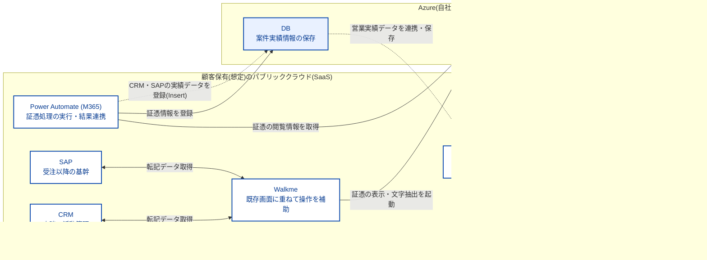

# 設計着手前のブレインストーミング資料

手戻りを防ぐため、本格的なドキュメント作成着手前に本ドキュメントを人間とエージェントで共同編集して細部を詰めていく。

## FactONE PJ全体構想

FactONEは、CRM ・ERP ・BI・案件実績保存DBを全社統一キーで連携し、販売プロセスの受注・売上見込み精度と説明力を検証するPoCである。

FactONEで取り扱う販売プロセスは**案件型**と**ルート型**に大別される。

- 案件型: 顧客ごとに個別提案・設計する取引。引合ごとに新しい案件IDを採番し、商談・見積・閲覧ログ・注文書・受注を紐付ける。受注/失注で完結。予測対象は「この案件を受注できるか」。
- ルート型: 同じ得意先・品目で繰り返す定常取引。得意先コード×品目コードごとにルートIDを発行し、同じIDを継続利用。見積工程なし。発注履歴を蓄積し、「次にいつ・いくつ注文されるか」を予測。

案件型では案件ID、ルート型ではルートIDを軸に履歴を集約する。

>[!important]
> 本ワークスペースでは以下のうち**IDP/Viewerに相当する部分の設計開発を実施**する。

**ソリューションの主目的**
- 販売プロセスで受注・売上見込みの精度と説明力を高める。
- 全社統一の案件IDで情報を集約し、着地見通しを時系列で説明できるようになる。

**ソリューションの副次目的**
- 入力品質の担保
  - 主担当: WalkMe/商談 ・活動管理(CRM)/ERP(SAP)
  - 実現イメージ:
    - CRM/ERP(SAP)の入力画面に全社統一の案件IDを必須入力にする仕組みをWalkMeで作る。(画面側制御で入力内容を揃える)
- 販売文書のデータ集約
  - 主担当: IDP(※1)/Viewer
  - 実現イメージ:
    - 見積もりPDF・WBSデータ・注文書PDFをIDPでデータ化し、案件IDに紐づけて共通データ基盤に保管する仕組みを作る。
    - PDFはViewerを介して開示を行い、送達・閲覧・DLの記録を取得・保存する仕組みを作る。
- 着地見込みの可視化
  - 主担当: DX分析・BI
  - 実現イメージ:
    - 案件IDに紐づく商談・顧客閲覧情報から、Engagement HistoryをRE(※2)スコア(5段階)化し、営業入力の受注確度と対比するロジックを作る。
    - ダッシュボードは増減から案件・注文書・元データまで遡れる構成にする。

> ※1 IDP = Intelligent Document Processing。機械学習などを用いたドキュメント処理の概念やサービス総称。本PJではAzure AI Document Intelligenceを指す。

> ※2 RE = Rolling Estimate/Rolling Forecast。最新のデータを使って将来の見通しを定期的に更新する予測手法のこと。

### 環境構成



### PJの目的

本ソリューションがシステムとして実現可能であるかの検証を主目的とする。

本PJでの検証を受けて実現可能であることが示されたら、それを商材として顧客提案へ移行する。

### 検証観点

**前提:対象データ期間・品目・顧客は限定し、既存システムへの本実装と本番相当の非機能要件(性能・セキュリティ・可用性)は対象外とする。**

1. 技術的成立性(想定通り動くか)
   1. 改修なしでの案件ID必須化
   2. 見積PDF・WBS・注文書の読取と集約
   3. 案件IDを軸にした2時点比較の成立
2. 精度(実務で信頼できるか)
   1. 注文書の項目別読取精度と人手修正率
   2. 見積・案件・WBSとの照合成功率と誤照合率
   3. システム間の関連付け成功率
   4. Forecast差異分類の正確性
3. 効果(業務が軽くなるか)
   1. 注文書1件あたりの確認・転記・保存時間
   2.  受領から受注登録までのリードタイム
   3.  入力ミス件数と自動完結率
4.  説明可能性(理由を遡れるか)
    1.  増減から案件・注文書・元データまでの遡及可否
    2.  変化理由を根拠付きで説明できた案件の割合
    3.  2時点の見込み履歴の保管と再現性
5.  事業性(横展開できるか)
    1.  イニシャルコスト、ランニングコスト概算と費用対効果
    2.  他顧客へ横展開可能なテンプレートとして切り出せるか
    3.  次フェーズ(ルート型・需要予測)への拡張性

### 利用シナリオ

#### 1. 見積取込 ・顧客開示(案件型)

1. 営業が見積PDF・WBS原価データを連携フォルダへ配置。
2. Power Automateが配置検知し、1ファイルにつき1文書IDを発行。
3. Power AutomateがIDP APIを呼び出し、項目データと確信度を取得。
4. Power Automateが案件IDを解決・付与し、PDF・項目データ・WBSを案件実績保存DBへ登録。冪等キーは案件ID+文書ID。
5. CRMからWalkMe経由でViewer起動。Viewerは文書IDを受領し、見積PDFの閲覧用URLを発行。
6. 顧客の閲覧・DLを文書ID付きイベントとして記録。Power Automateが日次取得し、文書IDから案件IDを解決して案件実績保存DB登録。

#### 2. 注文書取込・受注前処理(共通)

1. 営業が受領した注文書PDFを連携フォルダへ配置。
2. Power Automateが文書IDを発行し、IDP APIへPDFを送信。
3. IDPは得意先コード、品目コード、数量、納期、単価などを抽出し、項目別確信度を返却。
4. Power Automateが品目マスタを照会し、案件型/ ルート型 /判定不能を判定。IDPは判定しない。
5. 案件型は既存案件IDを引当て、ルート型は得意先コード×品目コードでルートIDをget-or-create。

#### 3. SAP承認時の原本照合(案件型・ルート型)

1. 営業がSAP承認画面から、必要時のみViewerを起動。
2. Viewerは文書IDに紐づく注文書PDFと既存の項目化結果を社内表示。顧客向けURLは発行しない。
3. 疑義がある場合、Viewer画面のIDP実行操作から同一SaaS内のIDPを再実行。
4. IDPは再項目化結果と確信度を返し、Viewerに表示。
5. SAP画面への値反映方式は未確定。営業が原本照合し、誤読を修正後に承認。

## IDP/Viewerに関する要件

完全新規での開発となるため、既存への依存は無し。他システムとの連携部分が主な制約となる。

### スコープと責務境界

| 対象 | IDP | Viewer |
| --- | --- | --- |
| 提供形態 | 同一マルチテナントSaaSのAPI | 同一マルチテナントSaaSの画面 |
| 主責務 | PDFの文字化・項目化、項目別確信度返却 | PDF表示、見積閲覧用URL発行、閲覧・DL記録、IDP実行と結果表示 |
| 案件型 | 見積PDF・WBS・注文書PDFの項目化 | 見積の顧客開示、注文書の社内原本照合 |
| ルート型 |注文書PDFの項目化 | 注文書の社内原本照合のみ |

非責務はIDP/Viewer共通で以下の通り。

- 案件ID・ルートID・文書IDの採番/解決
- 顧客固有名寄せ
- 型区分判定
- 確信度による自動・手動振分け
- SAP転記
- 案件実績保存DB
- RE・EWMA・D/V分析

### 機能要件

| ID | コンポーネント | 要件 |
| --- | --- | --- |
| IDP-01 | IDP | PDFバイナリと文書IDを受け付け、文字化・項目化結果を返すREST API。 |
| IDP-02 | IDP | 見積PDF、WBS原価データ、注文書PDFを処理可能。注文書の最低抽出項目は得意先コード、品目コード、数量、納期、単価。 |
| IDP-03 | IDP | 抽出値と項目別確信度を機械可読JSONで返す。 |
| IDP-04 | IDP | 初回実行と再実行を区別し、文書ID・実行日時・実行区分・抽出項目JSON・確信度JSONを記録可能。 |
| IDP-05 | IDP | 同一文書IDの再実行を許容。元PDFを変更せず、新しい実行結果を履歴追加。 |
| VWR-01 | Viewer | 呼出パラメータの文書IDから対象PDFを表示。案件ID・ルートIDを要求・保持しない。 |
| VWR-02 | Viewer | 案件型見積PDF向け閲覧URLを発行。URLと文書IDを関連付ける。 |
| VWR-03 | Viewer | 閲覧・DLイベントを文書ID、イベント種別、発生日時、必要な端末情報とともに記録。 |
| VWR-04 | Viewer | 注文書PDFは認証済み社内利用者の原本照合用途に限定。顧客開示URLを発行しない。 |
| VWR-05 | Viewer | 画面からIDP再実行し、項目化結果と確信度を表示。 |
| COM-01 | 共通 | PDF1ファイル=1文書ID。文書IDは呼出側から受領し、SaaS内で採番・解決しない。 |
| COM-02 | 共通 | API・イベント処理は再送を考慮。外部DB登録の冪等性は案件ID+文書ID、閲覧ログは文書ID+イベント発生日時。 |

### インターフェース要件

| IF | 呼出元→呼出先 | 方式 | 主要データ |
| --- | --- | --- | --- |
| IF-01 | Power Automate → IDP | REST API | 文書ID、文書種別、PDF/WBS、実行区分 |
| IF-02 | IDP → Power Automate | REST応答 | 抽出項目JSON、確信度JSON、処理結果、エラー |
| IF-03 | WalkMe/CRM → Viewer | Viewer起動 | 文書ID。URL要求のREST API化か画面操作か未確定(→ Q-IDPV-02) |
| IF-04 | Viewer → Power Automate/案件実績保存DB連携 | REST APIまたは差分取得 | 閲覧・DLイベント。取得方式未確定(→ Q-IDPV-03) |
| IF-05 | Viewer → IDP | 同一SaaS内部API | 文書ID、再実行区分 |
| IF-06 | Viewer/IDP → SAP画面 | 未確定 | 再項目化結果。画面反映方式の決定必要(→ Q-IDPV-04) |

### データ要件

- 文書メタデータ:
  - 文書ID
  - 文書種別
  - PDF参照先
  - 受領日時
  - テナント識別子
- IDP実行ログ
  - 文書ID+実行日時
  - 実行区分(初回/再実行)
  - 抽出項目JSON
  - 確信度JSON
  - 処理状態
  - エラー情報
- 閲覧イベント:案件IDは保持せず、外部連携側が解決。
  - 文書ID
  - イベント日時
  - イベント種別(閲覧/DL)
  - 端末情報
- 文書種別: 統合モデル採否は未確定(→ Q-IDPV-06)。
  - 見積文書(案件型)
  - 注文書文書(案件型)
  - 注文書文書(ルート型)
- データ保持: PoCでは本番水準の長期保持・バックアップ・DRを対象外。ただし機能検証に必要な期間は保持。

### 制約・対象外

- 顧客実データ不使用。検証用サンプル使用。
- 1PDF = 1注文書 = 1文書ID。PDF内複数注文書の分割処理なし。
- 全件Human in the Loop。確信度は返却・記録のみ。閾値判定や自動承認に使用しない。
- 確信度以外の型区分判定、案件ID・ルートID解決、品目名寄せはPower Automate責務。
- 判定不能・ID解決不能時の独自キュー、通知、再投入基盤なし。Power Automate標準実行履歴と手動再実行。
- EDI取込、請書・納期回答書、請求・売上計上は対象外。
- 本番水準の性能、同時実行数、SLA、可用性、監査、バックアップ、DR、長期保持は対象外。
- PoCでも接続認証、最小権限、サンプルデータ保護、文書IDのテナント跨ぎ一意性確認は対象。

### 検証 ・受入観点

- 見積PDF・WBS・注文書PDFを処理し、期待項目と確信度を返せる。
- 初回実行・再実行の双方で、文書IDを維持した履歴追跡が可能。
- 見積閲覧URL経由の閲覧・DLイベントを欠損・重複なく記録可能。
- 注文書は社内表示に限定され、顧客向けURLを発行しない。
- Viewerは案件ID・ルートIDなしで文書IDのみを用いて表示可能。
- IDP誤読時、原本表示 → 再実行 → 結果確認 → SAP側修正の流れを実行可能。
- 異常系: 非対応形式、破損PDF、必須項目未抽出、タイムアウト、再送、重複要求、他テナント文書ID。
- 測定指標: 項目別読取精度、人手修正率、1件あたり確認・転記・保存時間、受領から未承認登録までのリードタイム。

### 設計方針

- 業務キーと文書キーを分離。SaaS内部の主参照キーは文書ID。
- IDP APIは同期応答を基本案とするが、処理時間・サイズ上限により非同期化を検討(→ Q-IDPV-10)。
- API契約、JSON Schema、エラーコード、認証方式、最大ファイルサイズ、対応PDF条件、タイムアウト、再試行方針を実装前に確定。
- 抽出項目は文書種別別スキーマ。生OCR結果と正規化値、確信度を分離。
- イベント・実行ログは追記型。再実行で過去結果を上書きしない。
- 外部システム固有処理をIDP/Viewerへ持ち込まない。Power Automate、CRM、SAP、案件実績保存DBとの境界をアダプタ化。

### 未確定事項
| ID | 確認事項 | 実装影響 |
| --- | --- | --- |
| Q-IDPV-01 | 見積・注文書・WBSの確定抽出項目、型、必須/任意、正規化規則 | API Schema、UI、テストデータ |
| Q-IDPV-02 | CRM/WalkMeからViewerへの起動・閲覧URL発行方式 | Viewer API、認証、画面遷移 |
| Q-IDPV-03 | 閲覧ログの日次取得方式。REST pull、push、DB接続のいずれか | イベント保管、連携API |
| Q-IDPV-04 | 再IDP結果をSAP画面へ反映する方式 | Viewer出力、WalkMe連携、SAP入力 |
| Q-IDPV-05 | ルート型注文書の社内閲覧イベントも履歴化するか | 閲覧イベント対象範囲 |
| Q-IDPV-06 | 案件型・ルート型注文書文書を単一モデル+型区分へ統合するか | データモデル、API Schema |
| Q-IDPV-07 | 見積改訂履歴を保持するか | 見積文書多重度、URL世代管理 |
| Q-IDPV-08 | ~~PoCの認証方式~~(決定済: Keycloak+OIDC/PKCE)。残: テナント識別、ロール、文書アクセス認可 | セキュリティ設計 |
| Q-IDPV-09 | 対応ファイル形式、最大サイズ・ページ数、暗号化PDF・スキャン品質の扱い | IDP制限、エラー仕様、試験条件 |
| Q-IDPV-10 | 同期/非同期API、処理時間目標、再試行・タイムアウト値 | API方式、ジョブ管理 |
| Q-IDPV-11 | ~~バックエンドのVNet+PE隔離要否~~ **決定済: 隔離なし(技術スタック「Azureリソース」節参照)** | ネットワーク設計、コスト、IaC構成 |
| Q-IDPV-12 | 相乗り先SaaS環境のKeycloak realm構成(realm分離 or 単一realm+テナントクレーム) | realm設計、テナント識別、認可クレーム |

ここまでが要件として定められている項目。

---

## ADR記録候補

<!-- ADRとして残しておくべき事項のリスト化(ADRそのものは本格着手時に作成) -->

状態: `[決]`=方針決定済(ADR文書化待ち) / `[未]`=未確定(対応するQ-IDPV解消後にADR化)

ADRテンプレートはNygard原型ベースへ簡素化済(`docs/adr/0000-adr-template.md`: 背景/決定/検討した代替案/影響の4節+status/date)。MADRフル版のdecision-makers等はgit履歴・PRレビューで代替。本リストの「決定+却下案+理由」がそのまま流し込める構造。

### アーキテクチャ

- `[決]` 業務キー/文書キー分離。SaaS内部主参照キー=文書ID。案件ID・ルートIDを保持しない
- `[決]` 外部システム固有処理の境界アダプタ化(Power Automate・CRM・SAP・案件実績保存DBとの分離)
- `[未]` IDP APIの同期/非同期方式(Q-IDPV-10)
- `[未]` CRM/WalkMeからのViewer起動・閲覧URL発行方式(Q-IDPV-02)
- `[未]` 閲覧ログ連携方式: pull/push/DB接続(Q-IDPV-03)
- `[未]` 再IDP結果のSAP画面反映方式(Q-IDPV-04)

### データ

- `[決]` イベント・実行ログの追記型設計(再実行で上書きしない)
- `[決]` 生OCR結果と正規化値・確信度の分離保持
- `[未]` 文書種別の統合モデル採否(Q-IDPV-06)
- `[未]` 見積改訂履歴・URL世代管理の要否(Q-IDPV-07)
- `[未]` ルート型注文書の社内閲覧イベント履歴化要否(Q-IDPV-05)

### セキュリティ

- `[決]` 確信度の用途限定(返却・記録のみ。閾値判定・自動承認に不使用)
- `[決]` IdPにKeycloak採用(横展開先の社内SaaS環境がKeycloak採用済・相乗り想定。テナント模擬自由度・IdP中立性)
- `[決]` KeycloakのPoC配置(Container Apps相乗り・公式イメージ、PostgreSQL共用サーバ内別DB)
- `[決]` ネットワーク隔離なし・サービス側制御で締め(Q-IDPV-11解消。案B: VNet+PE完全隔離、案C: 部分隔離を検討・却下。本番テンプレートはVNet+PE前提と明記)
- `[未]` テナント識別・ロール・文書アクセス認可方式(Q-IDPV-08残部)、realm設計(相乗り先構成との整合 → Q-IDPV-12)

### 技術選定

- `[決]` バージョン方針: 開発着手時点の最新安定版採用
- `[決]` フロントエンドスタック(Vue.js+Vuetify+Pinia+Vite)
- `[決]` バックエンドスタック(Python+FastAPI+uv)
- `[決]` PDF画像化ライブラリ(pypdfium2)
- `[決]` IDP実現方式: 初手prebuilt-layout+Query Fields、精度不足時にカスタム抽出モデルへ段階移行(prebuilt流用・layout+LLMを検討・却下。ADRに比較記録)
- `[決]` Blobアクセス: API完全プロキシ・Blob全面非公開(短寿命SAS・併用案を検討・却下。ADRに比較記録)
- `[決]` Viewer書類表示: ページPNG化+SVGオーバーレイ(DI polygonをrect重畳。viewBoxをDI座標系に整合)
- `[決]` 閲覧URL: 不透明ランダムトークン+DB管理(署名付きトークンを検討・却下。ADRに比較記録。二要素化は本番化オプション)
- `[決]` IaCツール(Bicep)
- `[決]` Azureリソース構成(Container Apps+PostgreSQL+Blob+Key Vault、単一環境・Japan East)
- `[決]` フロント配信: Container Apps同居(案A: SWA無料、案C: SWA Standard+Easy Auth+リンクバックエンドを検討・却下。ADRに3案の比較を記録)
- `[決]` ブラウザ側認証: SPA+OIDC/PKCE(BFF自作を検討・却下。本番化時の強化オプションとしてADRに記録)

### 開発プロセス

- `[決]` GitHub Flow採用、mainへの直接push禁止・PR必須
- `[決]` PoC段階でのCI/CD見送り
- `[決]` イメージビルド: az acr build(ローカルコンテナ基盤不要)
- `[決]` 品質ゲート: pre-commit+PRチェックリスト、品質コマンド入口一元化でCI移行容易性担保(最小CI案はActions利用不適で却下。制約解消時の第一候補としてADR記録)
- `[決]` テスト方針: pytest/Vitest、検証価値基準の範囲傾斜、E2E自動化なし、外部依存はアダプタ差替え、DBは実PGコンテナ、カバレッジ数値ゲートなし
- `[決]` API契約型共有: Pydantic単一情報源+openapi-typescript生成、生成物コミット+pre-commit差分チェック(手動定義・スキーマファーストを却下。ADRに比較記録)
- `[決]` デプロイ手順: scripts/のbashスクリプトが正、docs/develop-guideは使い方のみ
- `[決]` Keycloak構成管理: realm JSONをkeycloak/でconfig-as-code管理、--import-realmで環境投入、シークレット非含有(環境変数注入)
- `[決]` ローカル開発ランタイム: WSL2+Podman主軸、共用RedHatサーバRemote-SSHフォールバック(Docker Desktop=ライセンス不可。ネイティブ・Azure共用案を却下。ADRに比較記録)

## 技術スタック

要件に矛盾しない限り担当者に決定権がある。主要方式は決定済み(各節の**決定**表記参照)。未決事項は各節の派生論点とQ-IDPV-xxに集約。

バージョン方針: 言語・フレームワーク・ライブラリはすべて**開発着手時点の最新安定版**を採用。個別バージョン番号は固定しない(実際の採用バージョンは着手時に確定・記録)。

### Azureリソース

PoCのため単一環境とする。リージョンは`Japan East`前提。

- フロントエンド配信: Container Apps同居(FastAPIの`StaticFiles`マウント。詳細・検討経緯は「フロント配信構成」節)
- API: コンテナアプリとして実行
  - コンテナ環境: Azure Container Apps Environment
  - コンテナイメージ保管: Azure Container Registry
  - アプリ実行: Azure Container Apps
- 認証基盤: Keycloak(Container Apps相乗り、公式イメージ。DBはPostgreSQL共用サーバ内別DB。詳細は「認証」節)
- バックエンド
  - 書類解析: Azure AI Document Intelligence(S0)
  - データベース: PostgreSQL Flexible Server(B1ms)
  - ストレージ: Azure Blob Storage
  - シークレット管理: Key Vault

セキュリティはPoC段階では最低限で良い。認証方式は決定済み(「認証」節)、テナント識別・ロール・文書アクセス認可の詳細のみ未定(→ Q-IDPV-08残部)。決定済みの骨子は以下。

- フロントエンドおよびAPIの認証はKeycloakで担保
- APIとバックエンドの各サービス間はマネージドID認証で担保

**ネットワーク隔離(Q-IDPV-11)決定: 隔離なし(案A)。**

- 構成: 全バックエンドサービスはパブリックエンドポイント。Managed ID認証全面+各サービスのファイアウォール規則+Blob匿名アクセス無効+TLS強制で締める
- 採用理由: ingressは顧客閲覧URL・Power Automate・WalkMe起動のため公開必須であり、論点はegress側のみ。PoCスコープ(サンプルデータのみ・本番非機能対象外)にVNet+PEは過剰。検証速度・コスト・開発アクセス容易性(プロキシ環境の社用PCからのDB接続)を優先
- 却下案の記録(ADR化時に転記):
  - 案B: VNet+PE完全隔離 — 本番相当テンプレートになるが、PE×4+VNetのコスト増、Bicep・DNS複雑化、開発PCからの接続に踏み台必要、障害切分け難度上昇
  - 案C: 部分隔離(PostgreSQLのみPE等) — 基盤コストは案Bとほぼ同じで選定根拠が立たず中途半端
- 留意: Container Apps(Consumption)のアウトバウンドIP非固定 → ファイアウォールが「Azureサービス許可」寄りの広い規則になる点は許容(PoC限定判断)
- 本番テンプレートはVNet+PE前提とし、Bicepはネットワーク層をモジュール分離してPE後付け可能な構造にする

### フロント配信構成

**決定: Container Apps同居配信(案B)。** FastAPIの`StaticFiles`マウントで静的ファイル配信(コンテナ1本、最小構成)。性能・責務分離が必要になれば同一Environment内の配信コンテナ分離へ発展。

ADR化時に検討案・却下理由を記録する:

- 案A: Static Web Apps無料プラン — 却下。Keycloak採用でカスタムOIDC不可(Standardのみ)、認証面の利点ゼロ。別オリジンでCORS管理必要
- 案B: Container Apps同居配信 — **採用**。単一オリジン(CORS不要)、全経路JWT検証一本で認証モデルが単純、デプロイ単位1つ、VNet+PE(Q-IDPV-11)採用時も構成不変
- 案C: SWA Standard + カスタムOIDC(Easy Auth) + リンクバックエンド — 却下。認証実装量は最小(トークン非露出をEasy Authで獲得)だが、(1)Power AutomateのIDP API直接呼出(IF-01)と`x-ms-client-principal`ヘッダ信頼モデルが併存し認証経路が二重化、ingressをSWA専用に閉じられず偽装対策が別途必要 (2)SWAはVNet不参加でQ-IDPV-11の隔離採用時に不成立 (3)相乗り先環境の構成と不整合の可能性

**ブラウザ側認証実装: SPA+OIDC/PKCE を採用。**

- 実装: Vueアプリが`oidc-client-ts`等でKeycloakと認可コードフロー+PKCE。アクセストークンはメモリ保持(短寿命+refresh token rotation)、API呼出は`Authorization: Bearer`。FastAPIはJWT検証のみ
- 採用理由: 実装量最小。全経路(ブラウザ・Power Automate)JWT検証一本で認証モデル単純。バックエンドステートレス維持
- 対抗案BFF自作は却下: トークン非露出(XSS耐性)は優るが、セッション管理・CSRF対策・トークン更新の自作コスト大。クッキー系とJWT系の認証二本立てになり案C却下と同じ構図。本番化時の強化オプションとしてADRに記録

### フロントエンド(Viewer)

- 言語: TypeScript(最新安定版)
- フレームワーク: Vue.js(最新安定版)
- UIライブラリ: Vuetify(最新安定版)
- アイコンライブラリ: Phosphor Icons(MIT,帰属表示不要)
- 状態管理方式: Pinia
- フロントエンドツール: Vite
- 依存管理: npm

### バックエンド(API)

- 言語: Python(最新安定版)
- フレームワーク: FastAPI
- 依存管理: uv
- PDF画像化ライブラリ: pypdfium2

### IDP実現方式(Document Intelligence)

**決定: 初手は`prebuilt-layout`+Query Fieldsで様子見。** 学習・ラベリングなしで項目指定抽出と確信度取得を試し、精度不足が判明した文書種別・様式から段階的にカスタム抽出モデルへ移行する。

- 採用理由: 学習準備工数ゼロで最速に精度検証へ入れる。Query Fieldsは項目別確信度を返すためIDP-03を満たす。PoCの精度検証(項目別読取精度・人手修正率)自体が「Query Fieldsで足りるか」の判断材料になる
- 段階移行先(精度不足時): カスタム抽出モデル(固定様式=template、ばらつく様式=neural、複数様式=composed)。カスタムneuralの学習対応リージョン(Japan East可否)は移行時に要確認
- 検討・却下案(ADR化時に記録):
  - プレビルト流用(prebuilt-invoice等) — 注文書・見積に合うモデルがなく項目マッピング不一致。不成立
  - layout+LLM抽出(Azure OpenAI) — 様式多様性には最強だが項目別確信度がネイティブに出ず、IDP-03・検証指標の根幹が弱る。次フェーズで様式多様性に直面した時の拡張案として記録
- 留意: Query Fieldsは実行ごとの項目指定のため、項目定義(Q-IDPV-01)確定後にクエリセットを文書種別別に固定化する
- WBS原価データ: 構造化ファイル(Excel/CSV)ならDIを通さず直接パースの可能性あり。様式確定(Q-IDPV-01)まで保留

### Blobアクセス方式

**決定: API完全プロキシ(案A)。** Blobは全面非公開とし、APIのみManaged IDでアクセス。PDF・画像の取得は全てFastAPI経由でストリーム配信し、配信時点で閲覧・DLイベントを記録する。

- 採用理由: VWR-03「閲覧・DLイベントを欠損・重複なく記録」を配信の唯一の関門として構造的に保証。SASキー管理不要、Blob設定最小(匿名無効+Managed IDのみ)。ネットワーク隔離なし(Q-IDPV-11)環境でもBlobの実効的露出ゼロ
- 検討・却下案(ADR化時に記録):
  - 短寿命SAS発行(クライアント直接取得) — 記録がSAS発行時点のみでTTL内の再閲覧・DL実態を捕捉不能。VWR-03と正面衝突。URL漏洩リスクも顧客開示用途で説明困難
  - 併用(顧客=プロキシ、社内=SAS) — 分離根拠薄く二方式維持コストのみ残る
- 転送負荷はPoC規模で無視可能。顕在化時にキャッシュ等で対処

### Viewer書類表示方式

**決定: ページ画像+SVGオーバーレイ方式。** PDFの各ページをPNGに変換(pypdfium2)し、SVGの`image`要素として表示。Document Intelligenceの読取矩形(polygon)を同一SVG領域に`rect`で重畳表示する。

- 利点: ブラウザ側PDFレンダラ(PDF.js等)不要。読取結果のハイライト・項目選択UIがSVG操作で完結。プロキシ配信(上記)とも整合(画像もAPI経由配信)
- 実装留意:
  - 座標系整合: DIのpolygon座標(ページ単位、インチ/ポイント)とPNG描画解像度のスケール整合が必須。SVGの`viewBox`をDI座標系に合わせるとrect座標が無変換で使える
  - 変換タイミング(未決小論点): 取込時に事前変換してBlob保存 vs 表示要求時オンデマンド変換。PoCはオンデマンド開始で性能問題があれば事前変換へ
  - 原本DLは変換画像ではなくPDF原本を配信(DLイベント記録対象)

### 閲覧URL署名方式(顧客向け見積閲覧URL)

**決定: 不透明ランダムトークン+DB管理(案A)。** 発行時に高エントロピー乱数(128bit以上、URL-safe)を生成し、DBへ「トークン・文書ID・発行日時・有効期限・失効フラグ」を保存。検証はDB照合。

- 採用理由: プロキシ配信決定により毎アクセスAPI通過が確定 → ステートレス検証の利点が無意味化。即時失効(誤送付・見積改訂時の差替え)が行更新のみで可能。発行レコードが世代管理台帳となりQ-IDPV-07決定時に自然拡張。トークン無情報のため漏洩時も文書ID非露出。鍵管理不要
- 却下案(ADR化時に記録): 署名付きトークン(JWT/HMAC、ステートレス) — 即時失効不可(失効リスト併設なら案Aと同じDB依存で利点消滅)、鍵ローテーション追加、ペイロード露出。PoCで得るものなし
- 付帯方針:
  - 有効期限: 発行時必須設定。既定値は業務要件(Q-IDPV-07関連)確定まで仮置き(例: 90日)
  - URL形式: トークンのみ露出(`/view/{token}`等)。文書ID・案件IDをURLに含めない
  - 総当り耐性: 128bit乱数で実質不能だが、失敗試行の記録+レート制限は実装
  - 顧客本人性の担保(URL+PIN等の二要素化)はPoC対象外。本番化オプションとしてADR記録

### 認証

- IdP: Keycloak(自前ホスト)
- 認証方式: OpenID Connect
- 採用理由:
  - 横展開時、社内展開済みSaaS環境への相乗り可能性大。同環境の認証基盤がKeycloak採用のため、PoCから合わせることで移行摩擦を排除。
  - テナント模擬の自由度(社内Entra統制非依存)とIdP中立性。
- 割切り: PoC期間限定運用。Keycloak自体の本番水準の可用性・堅牢化は対象外(ADR明記)。
- ホスト先: Container Apps相乗り。PoCではKeycloak公式イメージ利用。
- DB配置: PostgreSQL共用サーバ内の別DB。
- 構成管理: realm定義JSON(realmエクスポート)を`keycloak/`で管理し、config-as-codeの正とする。起動時`--import-realm`でローカル・Azure両方へ同一定義投入。realm JSONにシークレットを含めない(プレースホルダ+環境変数注入: ローカル=`.env`、Azure=Key Vault参照)。シークレット混入はpre-commitの検出対象。realm設計ドキュメントはQ-IDPV-12解消後に`docs/architecture/`へ作成、それまで`keycloak/README.md`に暫定運用のみ
- 派生論点(未決):
  - realm設計(realm分離 vs 単一realm+テナントクレーム)。相乗り先SaaS環境のrealm構成を確認のうえ整合させる(→ Q-IDPV-12)。

### IaC

- Bicep

## 開発方針

### プロジェクト·ソースコード管理

- GitHub Enterpriseでのリポジトリ管理を実施
- PoCのため軽量なGitHub Flowを採用
  - `main`ブランチから以下のブランチを作成して開発する(ルールセットで強制可能: 「作成制限」を全ブランチ対象+`feature/*`・`fix/*`・`main`除外指定でパターン外ブランチ作成を拒否)
    - 仕様変更: `feature/<issue番号>-<機能名の簡易説明>`
    - 不具合修正:`fix/<issue番号>`
- `main`ブランチへの直接pushは禁止
- `main`ブランチへのマージはPR必須とする
- Issuesで起票 → ブランチ作成して開発、という流れにしたい
- テンプレートを適用できるものは極力テンプレートを用意して構成を統一したい。
- テンプレート作成済(未コミット): `.github/PULL_REQUEST_TEMPLATE.md`(品質ゲート・テスト・API契約・ADRのチェックリスト)、`.github/ISSUE_TEMPLATE/feature.yml`・`bug.yml`(フォーム形式、ブランチ規約明記)、`config.yml`(空白Issue無効化)

ディレクトリ構成(案):

```
./
├─.github           # Issue/PRテンプレート(ISSUE_TEMPLATE、PULL_REQUEST_TEMPLATE.md)
├─api               # APIのソースコード
│  ├─tests
│  │  └─fixtures    # テスト専用フィクスチャ(破損PDF等)
│  └─Containerfile  # マルチステージビルド(stage1: node でviewer/ビルド → stage2: Python実行イメージへ成果物コピー)
├─bicep             # Bicepモジュール
├─docs              # 各種ドキュメントの格納ディレクトリ
│  ├─adr            # ADRを残しておく。設計ドキュメントには確定事項のみ記述する。
│  ├─api            # APIに関する設計ドキュメント(OpenAPIエクスポート含む)
│  ├─architecture   # モジュールを横断するような全体設計に関するドキュメント(Keycloak realm設計含む)
│  ├─azure          # Azureの各サービスに関する設計ドキュメント(storage.md, postgresql.mdのような)
│  ├─data-model     # データモデルに関する設計ドキュメント
│  ├─develop-guide  # 開発者向け資料(環境構築や開発手順を想定)
│  └─viewer         # Viewerに関する設計ドキュメント
├─keycloak          # Keycloak構成管理(realm定義JSON=config-as-codeの正、インポートスクリプト)
├─samples           # 検証用サンプルPDF(手動検証・営業レビュー共有物。出所・作成規約はdevelop-guideに記載)
├─scripts           # デプロイ等の運用スクリプト(bash。WSL2内実行、将来CIへ流用)
├─viewer            # Viewerのソースコード
└─compose.yaml      # ローカル開発スタック定義(Keycloak+PostgreSQL。Podman Compose実行)
```

補足:

- コンテナビルドは`az acr build`のコンテキストをリポジトリルートとし、`api/Containerfile`から`viewer/`・`api/`両方を参照(フロント同居配信の成果物同梱)
- 顧客実データ不使用の制約により、`samples/`のサンプル作成規約(実データ由来禁止・ダミー値規則)をdevelop-guideに定める

デプロイ手順の管理方針: **スクリプトが正、ドキュメントは薄く。** 実体は`scripts/`のデプロイスクリプト(az cli+`az acr build`+`az deployment`ラッパー)。`docs/develop-guide/deploy.md`は前提条件・使い方・トラブルシュートのみ(手順詳細の二重管理によるドリフト回避)。スクリプト言語はbash(WSL2主軸決定と整合、将来CIのLinuxランナーへ流用可)。

### CI/CD

PoC段階では見送る。

- 理由: GitHub Actionsは申請リポジトリ限定+コストセンタの問題でPoC利用不適
- 品質ゲートは下記「品質ゲート」で代替。将来のCI化を容易にする構造は維持する

### 品質ゲート

**決定: pre-commit+PRテンプレートチェックリスト(案A)。**

- 構成:
  - `pre-commit`フレームワークでコミット時にlint・format・型検査を実行(ruff・mypy / eslint・prettier等。ツール詳細は実装前に確定)
  - PRテンプレートに「テスト実行済」等の自己申告チェックリスト
- **入口一元化方針(CI移行容易性の担保):** lint・型検査・テストは`uv run`タスク・npmスクリプト等の単一コマンドに集約。pre-commit・PRチェックリスト・将来のCIすべてが同じ入口を叩く。CI化時は`pre-commit run --all-files`+テストコマンドを呼ぶ薄いワークフローを追加するだけ
- 限界の認識: ローカルフックは回避可能で強制力なし。PoC体制の規模なら運用でカバー、CI化で構造的強制へ移行
- 検討・却下案(ADR化時に記録): 最小CI(PR時lint+テスト+必須ステータスチェック) — 強制力は最良だがActions利用不適のため不成立。制約解消時の第一候補

### API契約の型共有

**決定: Pydantic単一情報源+OpenAPIからTS型生成(案A)。**

- 構成: FastAPI自動生成のOpenAPIスキーマ→`openapi-typescript`でTS型生成。クライアントは`openapi-fetch`(型付きfetchラッパー)
- ドリフト対策: 生成物をコミット対象とし、pre-commitで「再生成→差分検出したら失敗」チェック(品質ゲートの入口一元化に統合)
- 契約公開: Power Automate向け契約(IF-01/02)は同じOpenAPIエクスポートを`docs/api`に固定し、レビュー・共有する。設計方針「API契約を実装前に確定」の実行手段
- 検討・却下案(ADR化時に記録):
  - 手動型定義 — 二重管理・ドリフト不可避
  - スキーマファースト(OpenAPI手書き→両側生成) — FastAPI側スタブ生成が未成熟で二重管理化。契約先行の実質はエクスポート物のレビューで達成

### テスト方針

**フレームワーク:** API=pytest(+httpx/TestClient)、Viewer=Vitest+Vue Test Utils。エコシステム標準のみ、追加ツールなし。

**テスト範囲の傾斜(PoCの検証価値基準):**

- 厚くする(自動テスト必須):
  - 閲覧トークン発行・検証・失効(セキュリティ検証対象)
  - 閲覧・DLイベント記録の欠損・重複防止(VWR-03、検証・受入観点に直結)
  - DI応答のパース・正規化・確信度分離(IDP-03)
  - 座標変換(DI polygon→SVG viewBox整合)
  - 異常系: 非対応形式・破損PDF・タイムアウト・再送・他テナント文書ID(受入観点の異常系列挙に対応)
- 薄くする(手動確認で代替):
  - UIコンポーネントの見た目・操作性(全件Human in the Loop前提)
  - E2E自動化は導入しない。利用シナリオ1〜3の手動テストチェックリストで代替(PoC規模でPlaywright保守は過剰)

**外部依存の扱い:**

- Document Intelligence・Blob・Keycloakは境界アダプタ(設計方針参照)をモック/フェイクに差替え。実サービス接続テストは手動疎通確認に分離
- DBテスト: ローカルPostgreSQLコンテナ(Podman)接続の統合テスト。JSONB等PG固有機能利用のためSQLite代替はしない

**運用:**

- カバレッジ数値ゲートなし(形骸化リスク回避)。「厚くする」領域のテスト存在をPRチェックリスト項目で担保
- テスト関数には「何をテストするか」の簡潔な日本語コメントを付与する
- テストコマンドは品質ゲートの入口一元化に従う(`uv run pytest` / `npm run test`)

### 開発環境

- Windows 11 Enterpriseの社用支給PCで開発する。
- エディタはVisual Studio Codeを標準とする。
- GitHub Copilot Pro(またはEnterprise)
- Basic認証ありの社内プロキシ環境。各ツールのプロキシ設定が必要。
- プロキシサーバは証明書検証も実施している。

#### コンテナ実行環境

**制約: Docker Desktopは有償ライセンス抵触のため利用不可。**

- コンテナイメージビルド(デプロイ用): **`az acr build`(ACRクラウドビルド)で確定。** ソース送信→Azure側ビルドでローカルコンテナ基盤不要
- ローカル開発ランタイム(Keycloak・PostgreSQL): **案A主軸+案Dフォールバック**
  - 案A(主軸): WSL2+Podman(またはWSL2内docker-ce)。Podman: Apache-2.0・商用無償・docker CLI互換。留意: WSL2の社内利用可否、プロキシ証明書のWSL内配布設定、マシンスペック貧弱による快適性懸念
  - 案D(フォールバック): 共用RedHatサーバでのリモート開発(VS Code Remote-SSH)。案Aがスペック・ポリシーで不成立の場合に移行。成立条件: (1)開発者ごとSSHアカウント (2)サーバのoutbound HTTPS(プロキシ証明書信頼設定含む。VS Code Server・npm・PyPI・レジストリ取得) (3)メモリ目安=開発者数×1.5GB+余裕(2〜3人で16GB以上) (4)GitHub Enterprise到達性。リソース競合対策にrootless Podman+ユーザーごとポート割当規約
  - 検討・却下案(ADR化時に記録):
    - ネイティブインストール(PostgreSQL Windows版+Keycloak zip) — コンテナ基盤依存ゼロだが本番構成と乖離、手順属人化
    - Azure上の開発用共用インスタンス接続 — セットアップ最小だがオフライン不可・データ衝突・常時コスト